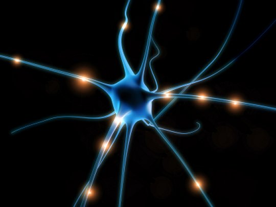

# neuroGAN
## Description
A python implementation of Generative Adversarial Network that sampled from neurons based on experimental data
## Prerequisites
- tensorflow r1.0 or higher version
- numpy 1.11.0
- matplotlib 2.0.2
- multiprocessing
- joblib
## USAGE
Run [main.py](main.py) with the command-line parameter 'train' or 'test'. 'train' will train the networks while 'test' will plot sampled tunning curves vs real neurons.
Other command-line arguments can find in the main file.
Note that the data is not available online because it's not published yet.

Note that it's work in progress threfore the generated samples are  
## References

